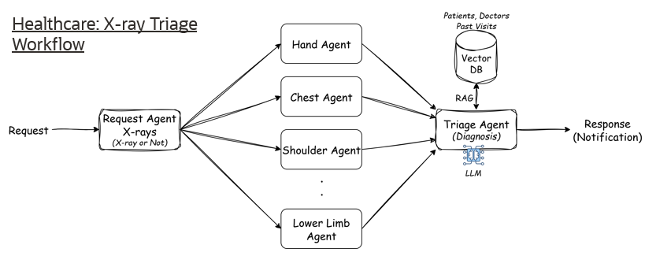
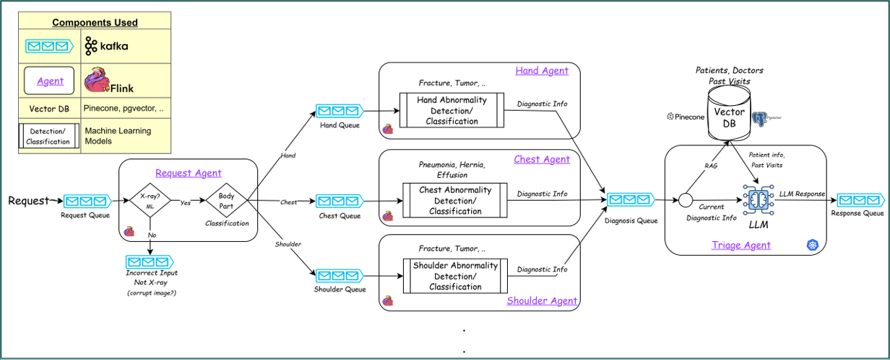
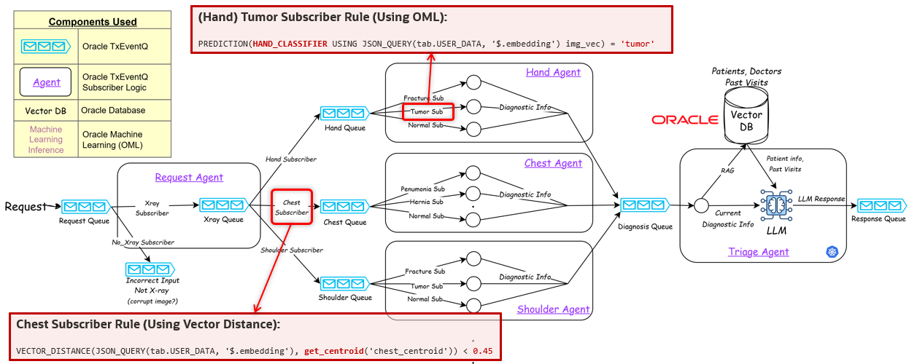

# Health Care Triage Agents Example with OML and TxEventQ

Aim is to build HealthCare Pre-Diagnosis AI Workflow. 

- Idea for the implementation is from blog What is a Triage AI Agent & How Do They Work? (link: https://ciphernutz.com/blog/what-is-triage-ai-agent)
    - A triage AI agent acts like a digital nurse assistant that listens to symptoms, analyzes them, and routes patients to the right care, faster.
- Paper published titled: End-to-End Deep Diagnosis of X-ray Images (link: https://arxiv.org/pdf/2003.08605)



Here, instead of using LLM to do diagnosis on images, we will use traditional machine learning algorithms on the fly on messages in event stream using Oracle Machine Learning (OML) functionality with Oracle's messaging platform called Transactional Event Queues (TxEventQ). It will make LLM the "last resort" agent, not the first stop for every event.

## Demo Health Care X-ray Image Triage (Pre-Diagnosis) Agentic Workflow Details 

- Idea is whenever patient comes to lab to some x-ray, CT-scans. After reports are generated it will go through our "Pre-Diagnosis AI Workflow" and generate some priliminary diagnosis which can help nurse or doctors to priorities customer or any other use-case.

### Without Oracle using Kafka for storing events and Flink for ML Agent deployment and triage agent (which is using LLM) and postgres/pinecone for vector DB



### Using Oracle TxEventQ for storing and filtering based on ML classification and Oracle for Vector DB and triage agent (deployment same as before)



## Requirements

- Python >= 3.10
- pip (or another installer)
- Optional: virtualenv
- Oracle Database COMPATIBLE parameter needs to be 23.4.0.0.0 or greater  (For using vector type)

## Project Structure

```
health_care_example/
├─ data/
│  ├─ metadata/
│  │  ├─ brain_centroid.npy     # Pre-computed centroid for brain images
│  │  └─ chest_centroid.npy     # Pre-computed centroid for chest images
│  ├─ train/                    # Downloaded data set from kaggel (currently few images)
│  │  ├─ brain/
│  │  │  ├─ glioma/
│  │  │  ├─ meningioma/
│  │  │  ├─ notumor/
│  │  │  └─ pituitary/
│  │  └─ chest/
│  │     ├─ NORMAL/
│  │     └─ PNEUMONIA/
│  └─ test/                    # for testing
│     ├─ brain/
│     │  ├─ glioma/
│     │  ├─ notumor/
│     │  └─ pituitary/
│     ├─ chest/
│     │  ├─ NORMAL/
│     │  └─ PNEUMONIA/
│     └─ queue_test/
│
├─ docs/
│  └─ images/                     # Architecture diagrams
│
├─ src/
│  └─ health_care/
│     ├─ client/
│     │  ├─ send_request.py       # Sends diagnosis request to TXEventQ
│     │  └─ receive_response.py   # Receives diagnosis response
│     │
│     ├─ pre_processing/
│     │  ├─ training.py
│     │  ├─ testing.py
│     │  ├─ data_table_creation.sql
│     │  ├─ test_table_creation.sql
│     │  ├─ patient_table.sql
│     │  ├─ vect_table.sql
│     │  ├─ testing_data.sql
│     │  ├─ oml_model_creation.sql
│     │  ├─ create_txeventq_user.sql
│     │  ├─ calculate_centroid_threshold.sql
│     │  │
│     │  └─ queue_setup_script/
│     │     ├─ brain_queue_setup.sql
│     │     ├─ chest_queue_setup.sql
│     │     ├─ diagnosis_queue_setup.sql
│     │     ├─ request_queue_setup.sql
│     │     └─ reponse_queue_setup.sql
│     │
│     ├─ util/
│     │  ├─ config.py             # App configuration DB config + LLM config
│     │  ├─ embed.py              # Image embedding logic
│     │  └─ txeventq_helper.py    # TXEventQ enqueue/dequeue helper
│     │
│     └─ worker/
│        ├─ agent/
│        │  ├─ diagnosis_agent.py # AI diagnosis agent
│        │  └─ llm_processing.py  # LLM processing logic
│        │
│        └─ txeventq_subs/
│           ├─ brain_notumor_sub.py
│           ├─ brain_tumor_sub.py
│           ├─ chest_normal_sub.py
│           ├─ chest_pneumonia_sub.py
│           ├─ request_brain_sub.py
│           ├─ request_chest_sub.py
│           └─ txeventq_worker.py # Queue worker helper
│
├─ pyproject.toml
├─ requirements.txt
└─ README.md
```

## Installation

```bash
pip install -e .  # Install the project and dependencies in editable/development mode
```

You can install dependencies using `requirements.txt`.

### Option A: requirements.txt

```bash
# Create and activate a virtual environment (recommended)
python -m venv .venv
# Windows
.venv\Scripts\activate
# macOS/Linux
# source .venv/bin/activate

pip install --upgrade pip
pip install -r requirements.txt
```

## Configguration Variables

The code uses configuration stored in `src\health_care\util\config.py`. For simplicity we have used the python file to store DB credentials and LLM API configuration. One can use `.env` file for this purpose.

- `DB_DSN` - provide data source name
- `OCA_TOKEN` - provide OCA token

## Steps to run the Demo

### Preparing Database

Before running ensure you have a user who has a privileges to operate on TxEventQ. 
You can run `create_txeventq_user.sql` script in your database and provide same credentials in `src\health_care\util\config.py` file.

### Preprocessing

#### Training 

As we are going to use OML model based in database; we put the training data in DB and then create SVM (support vector machine) classification model on the table data.

##### 1. Download the data

I have used various kaggle dataset and consolidated in this sharepoint link: [train.zip](https://oracle-my.sharepoint.com/:u:/p/kalpesh_dusane/IQCNC_dZ5DKcRJhnooWQZ28JAQRzWhJyx_IcVivhsTsoOto?e=Slwjce) (size ~ 1.19GB)
Please download the data set and unzip the file and override the `train` folder data onto `data\train` (or remove the repo folder and put the `train` folder)

You can also download the dataset from following:
- Chest X-ray data set is taken from kaggle: https://www.kaggle.com/datasets/alifrahman/chestxraydataset
- Brain Tumor data set is taken from kaggle: https://www.kaggle.com/datasets/masoudnickparvar/brain-tumor-mri-dataset
But keep the file structure same as in the repo.

Follow the steps:

> **Note:** All the SQL script should be run from the user connected to DB which is created by `create_txeventq_user.sql` script script 

###### 1. Create tables for training

```sql
@src/health_care/pre_processing/data_table_creation.sql
```

###### 2. Run python code to compute the Centroid and put the data inside the Oracle DB. Run the following command from inside `pre_processing` directory.

```bash
python training.py
```

###### 3. Now, We have the training data ready, Lets create OML models on that data by running following SQL

```sql
@src/health_care/pre_processing/oml_model_creation.sql
```

###### 4. Optional, follow the steps if you want to tinker with threshold parameters like computing threshould for vector centroid and for testing OML rule

i. threshould for vector centroid

```sql
@src/health_care/pre_processing/calculate_centroid_threshold.sql
```

ii. Tesing our OML model:

first create separate table for testing

```sql
@src/health_care/pre_processing/test_table_creation.sql
```

Fill the test table using python script and using test data from `data\test` directory (You can add more examples)

```bash
python testing.py
```

Now run the testing query using `PREDICTION` and `PREDICTION_PROBABILITY` SQL operators:

```sql
@src/health_care/pre_processing/testing_data.sql
```

Here you can observe, how well SVM model is classifying the testing data. 

###### 5. Now it is time to setup Queues.

> All the queues are created using *JSON* payload type

Here we have following TxEventQ:
  - request_queue 
      - subscribers classification using vector centorid
  - response_queue
  - brain_queue
      - subscribers classification using ML classifier
  - chest_queue
      - subscribers classification using ML classifier
  - diagnosis_queue

```sql
@src/health_care/pre_processing/queue_setup_script/request_queue_setup.sql
@src/health_care/pre_processing/queue_setup_script/reponse_queue_setup.sql
@src/health_care/pre_processing/queue_setup_script/brain_queue_setup.sql
@src/health_care/pre_processing/queue_setup_script/chest_queue_setup.sql
@src/health_care/pre_processing/queue_setup_script/diagnosis_queue_setup.sql
```

###### 6. Add dummy patients data for demo

```sql
@src/health_care/pre_processing/patient_table.sql
```

[optional] for using vector database:

Here, you have to download `pp_minilm_l6.onnx` model file ([share point link](https://oracle-my.sharepoint.com/:u:/p/kalpesh_dusane/IQC9woYrJ7ETRpzJLXTSnyyCAeuVya-v_VBPNX0E7S27B4g?e=by9Dvf)) and put that inside DB and provide that path in `vec_table.sql`.

For Creating your own `pp_minilm_l6.onnx` file:

```python
from oml.utils import ONNXPipeline, ONNXPipelineConfig

# Export to file
pipeline = ONNXPipeline(model_name="sentence-transformers/all-MiniLM-L6-v2")
pipeline.export2file("pp_minilm_l6",output_dir=".")
```

The above python code will create ONNX model `pp_minilm_l6.onnx`
For more details goto Oracle documentation page: [Convert Pretrained Models to ONNX Model: End-to-End Instructions for Text Embedding](https://docs.oracle.com/en/database/oracle/machine-learning/oml4py/2-23ai/mlpug/convert-pretrained-models-onnx-model-end-end-instructions.html)

Run the following SQL script :

```sql
@src/health_care/pre_processing/vec_table.sql
```

###### 7. Now running the workers to start the workflow

> **NOTE**: by default we have added timer of 10 mins, so if it found no messages worker will come out of the loop (exits)

i. First start the all the TxEventQ subscriber workers. Each workers is dequeuing (fetching) from its TxEventQ and add the diag or extra info and then Enqueuing (Processing) it to next TxEventQ 

Run the following python script from `src\health_care\worker\txeventq_subs`

```bash
python request_brain_sub.py
python request_chest_sub.py
python brain_notumor_sub.py
python brain_tumor_sub.py
python chest_normal_sub.py
python chest_pneumonia_sub.py
```

ii. Run the Diagnosis Agent,
- Which is will dequeue the request from diagnosis_queue and extract the additional diagnosis added by previous txeventq subscriber workers, 
- and access the patient_info for patient details and past_visits for patient history. 
  - Here optionally it will use the vector search by converting requests type with history to retrive only relevent history 
- Then generate the prompt and use the LLM (hosted on OCA) to generate the response and enqueue (post) it to response_queue

```bash
python diagnosis_agent.py
```

## Running the Clients

Ensure the above steps are running first.

1. Run response worker from `client` directory (it is simulating that how the nurse or doctor receive the pre-diagnosis of report)

```bash
python receive_response.py
```

2. Now Run the client from `client` directory, it will send the X-ray report provided in path (`data\train\brain\glioma`) of `send_request.py` file.

```bash
python send_request.py
```

## Troubleshooting

- Although you can spwan and run workers parallelly, the most time will be taken by 'Diagnosis Agent' by LLM, So to scale or reduce latency you can spwan more workers of `diagnosis_agent.py`


