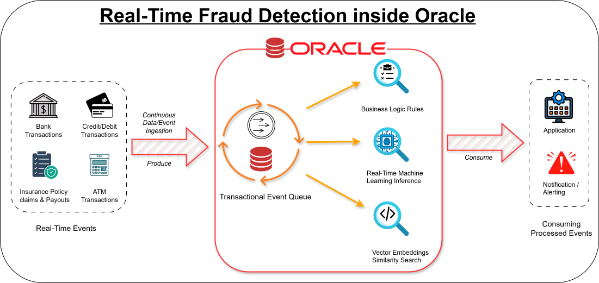

# Real-Time Fraud Detection using Oracle TxEventQ and Oracle Machine Learning (Python + SQL)

A minimal example project showing a real-time fraud-detection workflow using Oracle Database & Transactional Event Queues (TxEventQ):

- Load training + testing CSV data into Oracle tables
- Train an anomaly-detection model (Isolation Forest) in Python
- Train an anomaly-detection model (SVM) inside Oracle DB
- Export the model to ONNX and (optionally) load it into Oracle
- Publish/consume events via TxEventQ (sync + async enqueue/dequeue examples)

Primary scripts live under `code/` and sample data lives under `data/`.



## Requirements

- Python >= 3.13.11
- pip (or another installer)
- Optional: virtualenv
- Oracle Database 23ai (recommended)
- Network access / credentials for the database user used by the scripts

## Installation

Install dependencies using `requirements.txt`.

```bash
# Create and activate a virtual environment (recommended)
python -m venv .venv
# Windows
.venv\Scripts\activate
# macOS/Linux
# source .venv/bin/activate

pip install --upgrade pip
pip install -r requirements.txt
```

## Configuration

This repo uses `code/config.ini` for database connectivity.

Update `code/config.ini` with your Oracle connection details. The scripts typically expect fields like:

- `username`
- `password`
- `dsn` (host/service, EZConnect, etc.)

## Preparing Database

Run the SQL scripts in `code/` in order (they are numbered to match the intended flow):

1. `01_create_txeventq_user.sql` (optional if already DB user created) create the DB user and grant privileges
2. `02_txeventq_setup.sql` create/setup TxEventQ objects
3. `03_fixed_rule_subscriber.sql` fixed rule subscriber
4. `04_train_data_setup.sql` create training table(s)
5. `09_test_data_setup.sql` create test table(s)

Notes:
- Exact privileges and object names depend on your Oracle version and configuration.
- If you created a dedicated user in step 1, place those credentials in `code/config.ini`.
- Run all the sql script from the user created by `01_create_txeventq_user.sql` script.
- Execute all the python code from inside `code/` folder.

## Running the Workflow

### 1) Load training data if user is going to create SVM model inside DB

```bash
python 05_insert_training_data.py
```

```SQL
@06_svm_unsupervised.sql
```
Note: Run all the sql script from the user created by `01_create_txeventq_user.sql` script.

### 2) Train the model (Isolation Forest) and export ONNX

```bash
python 07_isolation_forest.py
```

This produces/uses an ONNX model under `metadata/` (see `metadata/isolation_forest.onnx`).

### 3) (Optional) Import the ONNX model into Oracle

```bash
python 08_1_import_onnx_model.py
```

There is also a SQL variant, if you have ONNX file inside DB server then run the following:
- `08_2_load_onnx_from_db_server.sql`

### 4) (optional) Load testing data

```bash
python 10_insert_testing_data.py
```

### 5) (optional) Verify test data

Run:
- `11_test_data_verify.sql`

### 6) TxEventQ enqueue/dequeue examples

Synchronous:
```bash
python 13_txeventq_eq.py
python 14_txeventq_deq.py
```

Async:
```bash
python 15_txeventq_eq_async.py
python 16_txeventq_deq_async.py
```
User can put the consumer name and pass it to dequeue_wrapper while executing `16_txeventq_deq_async.py` file.

### Cleanup

Run:
- `17_cleanup.sql`

## Project Structure

```
fraud_detection/
├─ code/
│  ├─ 01_create_txeventq_user.sql
│  ├─ 02_txeventq_setup.sql
│  ├─ 03_fixed_rule_subscriber.sql
│  ├─ 04_train_data_setup.sql
│  ├─ 05_insert_training_data.py
│  ├─ 06_svm_unsupervised.sql
│  ├─ 07_isolation_forest.py
│  ├─ 08_1_import_onnx_model.py
│  ├─ 08_2_load_onnx_from_db_server.sql
│  ├─ 09_test_data_setup.sql
│  ├─ 10_insert_testing_data.py
│  ├─ 11_test_data_verify.sql
│  ├─ 12_oml_rule_subscriber.sql
│  ├─ 13_txeventq_eq.py
│  ├─ 14_txeventq_deq.py
│  ├─ 15_txeventq_eq_async.py
│  ├─ 16_txeventq_deq_async.py
│  ├─ 17_cleanup.sql
│  └─ config.ini
├─ data/
│  ├─ train_data.csv
│  ├─ test_data.csv
│  ├─ train_data_blog.csv
│  ├─ test_data_blog.csv
├─ metadata/
│  └─ isolation_forest.onnx
├─ requirements.txt
└─ README.md
```

## Troubleshooting

- `DPI-1047` / Oracle Client library issues
  - If you enabled thick mode in `oracledb`, ensure Oracle Client libraries are installed and on PATH.
  - Otherwise, keep using thin mode (default) and verify your DSN.
- Login failures / ORA- errors
  - Re-check credentials and DSN in `code/config.ini`.
  - Ensure the user has required privileges for tables, OML (if used), and TxEventQ.
- Queue enqueue/dequeue does nothing
  - Confirm TxEventQ objects exist (run `code/02_txeventq_setup.sql`).
